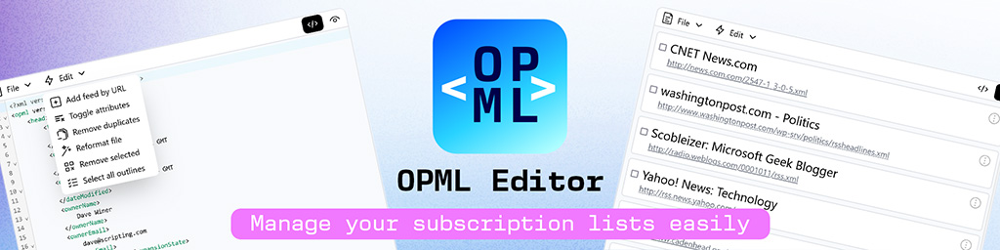

  

# OPML Editor

A simple free online [OPML](https://en.wikipedia.org/wiki/OPML) editor tailored for managing [subscription lists](http://scripting.com/2016/10/13/whatIsAnOpmlSubscriptionList.html) (RSS & Atom feeds).

Visit here: [opml.imadij.com](https://opml.imadij.com)

## Features
- Add new feeds to the list
- Merge multiple OPML files
- Remove any duplicate feeds
- Rearrange your feeds interactively

## Acknowledgements
- [Svelte](https://svelte.dev/)
- [CodeMirror](https://codemirror.net/)

## LICENSE
This project is licensed under the AGPL-3.0 License - see the [LICENSE](LICENSE) file for details.