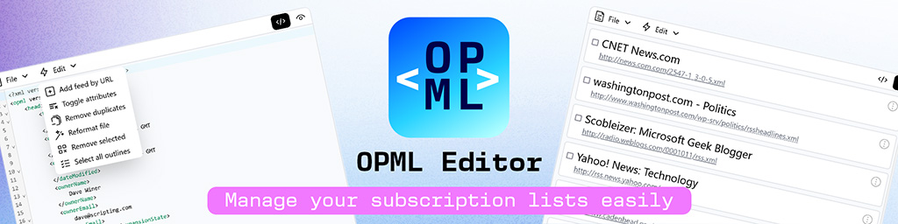

  

# OPML Editor

Manage your [feed subscription lists](http://scripting.com/2016/10/13/whatIsAnOpmlSubscriptionList.html) more easily using a free online [OPML](https://en.wikipedia.org/wiki/OPML) editor with a simple and intuitive interface. View, edit, merge, clean, and organize your opml files online.

Built to promote a more open web. No tracking, no ads, no sign-ups.

Visit the web app here: [opml.imadij.com](https://opml.imadij.com)

## Features
- Merge multiple OPML files together
- Remove any duplicate feeds
- Organize and rearrange your feeds interactively
- Subscribe to new feeds
- Keyboard shortcuts for common functionalities
- Extract URLs from OPML files
- Generate OPML files from a list of URLs

## Acknowledgements
- [Dave Winer](http://davewiner.com/) for creating the OPML format and all the effort he has put into the ecosystem
- [Svelte](https://svelte.dev/) as the web framework of choice
- [CodeMirror](https://codemirror.net/) as the code editor
- [Iconoir](https://iconoir.com/) as the icon set

## LICENSE
This project is licensed under the AGPL-3.0 License - see the [LICENSE](LICENSE) file for details.